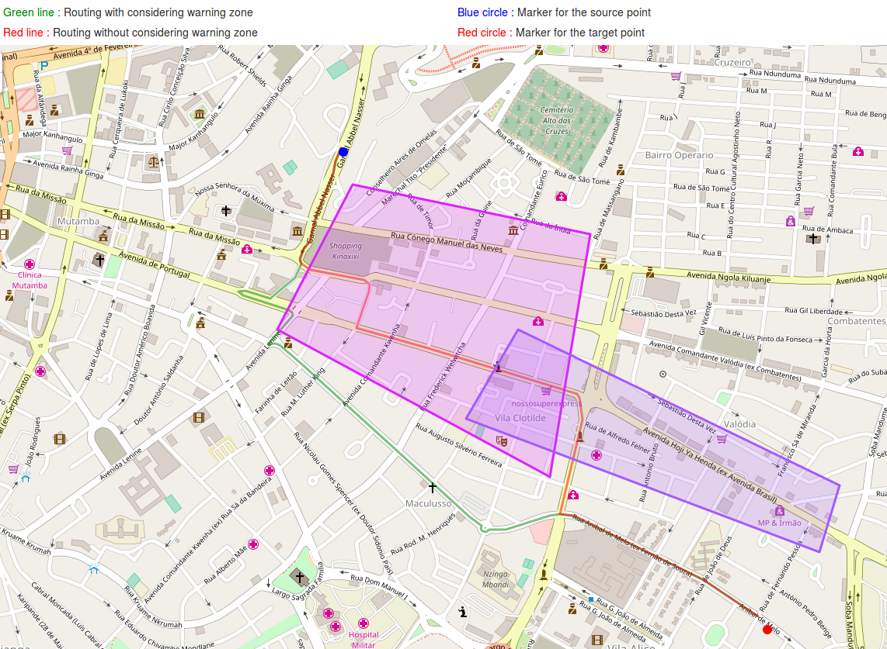

# Networkx routing
Though some routing APIs exist (OSRM, Google API direction), we decided to create one which is not data-graph-dependant.

## What is Networkx routing ?
Networkx routing, based on networkx python library, is a routing api. As a routing api, it provides a web RESTful API.
The main goal of this API is to fusion input format data (OSM, Google, Tomtom) once the graph has been created. With networkx, we are able to unleash the full potential of geographical data provider.

Networkx is keeping graph theory simple. That means only one parser feature is required to import a new data format.

Another one powerful feature of Networkx routing is to used valuable graph. That means you can specify blocking|warning zones to avoid them, or reachable|safety zones to go through them.

## Requirements :
Networkx routing is keeping the things simple. You only need :
- a clean python installation
- the networkx package
- some data streams :
  - input data and its relative parser to generate the graph
  - geojson data provider to valuate the graph

## How does Networkx routing rock ?
As a picture is worth a thousand words, here is a full-chain example from OSM data :

> Note : this usecase is the first draft we made to meet our needs. Do not focus on exchanged data format which, of course, do not follow geojson-format specifications. 

Networkx routing follows these steps to meet the needs :
1. Getting the data from OSM data provider [OSMParser].
   > The graph is generated.
2. Getting the data from geojson data provider (looks like a postgis database) [fillWeightMatrix]
   > The graph is valued.
3. Listen requests from the users of the application [osmToPython]
   > The "shortest path" *(depending of your query)* is computed.
4. Networkx routing makes users happy.
